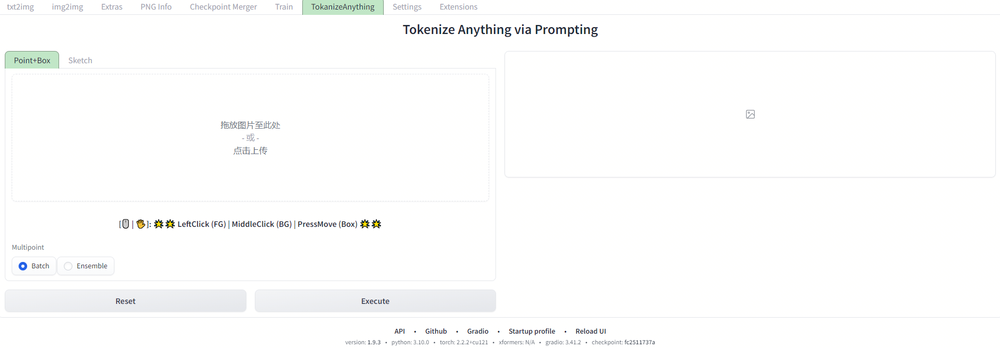

# sd_webui_tokenize_anything

Extension for [webui](https://github.com/AUTOMATIC1111/stable-diffusion-webui). This is a outpainting to image demo using diffusers and the [gradio library](https://github.com/gradio-app/gradio). 




Find the UI for tokenize—anything in the Extras tab after installing the extension.

## Getting more models offline
Put your models into the `models` directort inside the extension. For example, my model can be
made fully offline by placing fines from https://huggingface.co/BAAI/tokenize-anything into those directories:

```

 📁 webui root directory
 ┗━━ 📁 extensions
     ┗━━ 📁 sd_webui_tokenize_anything
         ┗━━ 📁 models                           
             ┣━━ 📄 tap_vit_l_v1_1.pkl             
         ┗━━ 📁 concepts                           
             ┣━━ 📄 merged_2560.pkl 
```


# Installation

Install from webui's Extensions tab.

# Credits

* tokenize_anything library that does all the work: https://github.com/baaivision/tokenize-anything

Due to the current support of Gradio in Stable Diffusion WebUI being up to version 3.41.2, while Tokenize Anything requires Gradio version 4.1.x for its point-clicking feature on graphs, there is a conflict, and there isn't a satisfactory solution at the moment.
